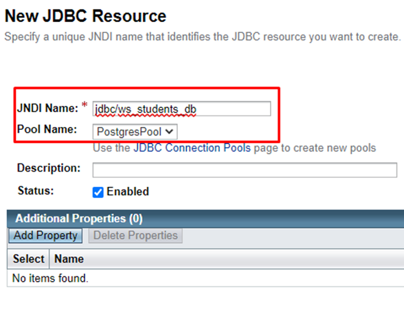

**Лабораторная работа 1, часть 2, реализация в виде Java2EE приложения**

# Ход работы

1. В первой части работы, при реализации standalone-приложения была создана база данных PostgreSQL.
В данной части работы необходимо подключить созданную БД к серверу приложений Glassfish.
Для этого изменяем настройки в консоли администрирования Glassfish – создаем новый Pool и Resource в 
JDBC Connection Pools и JDBC Resources, соответственно. 
Указываем JNDI-имя - jdbc/ws_students_db.



Теперь создадим три основных класса и попробуем вывести данные из таблицы через запрос из SOAPUI.
Необходимо создать класс Student – POJO в соответствии с таблицей students БД, 
класс StudentWebService – веб-сервис с инъекцией источника данных, настроенного на стороне сервера приложений и 
PostgreSQLDAO – Data Access Object.
Класс Student содержит поля и методы в соответствии с сущностями БД. 
Конструктор принимает на вход соответствующие БД значения, также указано конструктор без аргументов. 
Среди методов – геттеры и сеттеры, а также переопределение toString. 
В соответствии с этим создаем метод getAllStudents() в PostgreSQLDAO, указав соответствующие поля. 
Подключение будем получаем в конструкторе из StudentWebService.
В StudentWebService для класса указываем аннотацию с названием сервиса GetAllStudentsService, и 
также указываем аннотацию для источника данных в соответствии с ранее обозначенным JNDI-именем jdbc/ws_students_db. 
Подключение создаем в соответствии с методическим пособием.
В итоге выполнив запрос через SoapUI мы должны получить данные из БД. 
В запросе необходимо указать адрес http://localhost:8080/GetAllStudentsService и в теле запроса <ws:getAllStudents>.

Далее переходим к реализации требуемого функционала поиска, учитывая ранее разработанное standalone-приложение.

Внедрение зависимости с БД в классе StudentWebService:
```java
    @Resource(lookup = "jdbc/ws_students_db")
    private DataSource dataSource;
```

Также, теперь мы создаем в данном классе подключение, которое передаем при создании объекта PostgreSQLDAO.
Далее по аналогии со stanalone-приложением необходимо добавить классы PostgreSQLDAO и Student.

Для получения подключения к БД в PostgreSQLDAO добавим соответствующий конструктор:

```java
public class PostgreSQLDAO {
    private Connection conn;

    public PostgreSQLDAO() {
    }
    public PostgreSQLDAO(Connection conn) {
        this.conn = conn;
    }
    
    ...

```
В итоге мы получим Java2EE приложение с аналогичным функционалом. Для запуска необходимо собрать war-архив (например, 
при помощи Maven) и подгрузить его на Glassfish сервер-приложений. В работе используется функционал Intellij IDEA и 
локальная версия Glassfish. Формирование окружения разработки описано в первой части работы. 
Для сборки в директории с pom.xml необходимо выполнить:
```shell
mvn package
```

В Intellij IDEA в конфигурацию запуска проекта добавить Glassfish, который был ранее установлен с Java2EE SDK и 
указать путь к собранному war-архиву. 

Клиент взят из реализации standalone-приложения в виде jar-архива. Для запуска клиента можно использовать команду:
```shell
# запуск клиента
java -jar lab1_client.jar
# если проблемы с выводом кириллицы в консоли при запуске jar-файла, то стоит указать флаг
java -jar -Dfile.encoding=UTF-8 lab1_client.jar
```